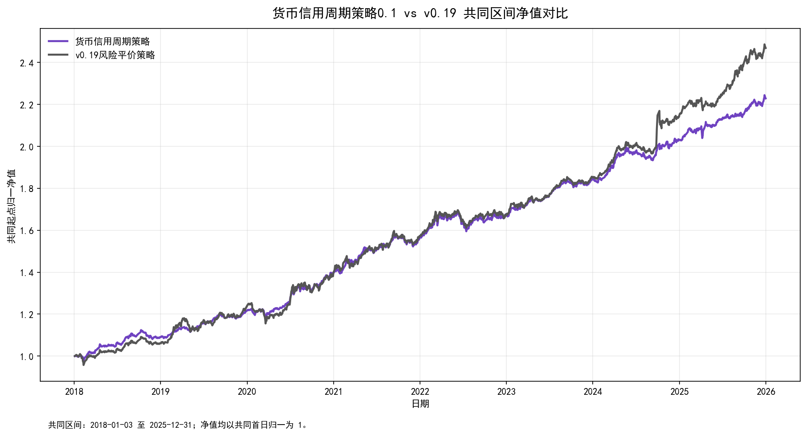

# 货币信用周期策略0.1回测对比说明

## 结论摘要

- 共同回测区间为 `2018-01-03 至 2025-12-31`，共 `1941` 个交易日；两条净值均在共同首日归一为 1。
- `货币信用周期策略` 期末净值为 `2.2290`，低于 `v0.19风险平价策略` 的 `2.4694`；年化收益差为 `-1.49%`。
- 风险端看，`货币信用周期策略` 年化波动比 v0.19 低 `1.41%`，最大回撤比 v0.19 更浅 `2.39%`，夏普差为 `0.23`。
- 年度维度 `货币信用周期策略` 在 `3/8` 个年份跑赢 v0.19；最好相对年份为 `2018`，最弱相对年份为 `2024`。

## 对比口径

- 对比对象：`货币信用周期策略` 与 `v0.19风险平价策略`。
- 对比区间：取两者净值都有数据的共同区间，避免起止日差异影响。
- 年度收益：首年按共同起点至当年末计算，后续年份按上一年末至当年末计算。
- 归一方式：共同首个交易日净值统一归一到 1，仅用于横向比较。

## 核心指标

| 策略 | 共同区间 | 交易日数 | 期末净值 | 累计收益 | 年化收益 | 年化波动 | 夏普比率 | 最大回撤 | 最大回撤开始 | 最大回撤结束 | 日胜率 | 月度胜率 | 年度收益均值 |
| --- | --- | --- | --- | --- | --- | --- | --- | --- | --- | --- | --- | --- | --- |
| 货币信用周期策略 | 2018-01-03 至 2025-12-31 | 1941 | 2.2290 | 122.90% | 10.97% | 5.09% | 2.07 | -5.39% | 2022-06-09 | 2022-07-15 | 57.14% | 77.89% | 10.56% |
| v0.19风险平价策略 | 2018-01-03 至 2025-12-31 | 1941 | 2.4694 | 146.94% | 12.45% | 6.49% | 1.84 | -7.79% | 2020-01-20 | 2020-03-19 | 56.21% | 70.53% | 12.03% |

## 年度收益

| 年份 | 货币信用周期策略 | v0.19风险平价策略 | 超额收益 |
| --- | --- | --- | --- |
| 2018 | 9.02% | 6.12% | 2.90% |
| 2019 | 11.60% | 16.52% | -4.92% |
| 2020 | 14.82% | 13.21% | 1.62% |
| 2021 | 11.98% | 12.40% | -0.42% |
| 2022 | 7.20% | 6.41% | 0.79% |
| 2023 | 9.90% | 10.59% | -0.69% |
| 2024 | 10.20% | 15.97% | -5.77% |
| 2025 | 9.74% | 14.99% | -5.25% |

## 净值图

## 解读

`货币信用周期策略0.1` 只在月初根据货币信用周期切换优选资产池，再对入选资产做风险平价。它显著降低了仓位切换频率，也剔除了部分周期内表现较弱的资产，但相比 v0.19 的日频风险平价框架，整体风险暴露和收益捕捉更克制。

因此，0.1 更适合被看作一个低换手、低波动的周期约束版本；如果目标是提高共同区间收益，后续应重点观察周期资产池剔除规则是否过严，以及月频调仓是否错过了 v0.19 在趋势阶段的再平衡收益。

## 输出文件

- 净值明细：`回测结果\净值\货币信用周期策略0.1净值对比.csv`
- 指标表：`回测结果\指标\货币信用周期策略0.1回测对比指标.csv`
- 年度收益表：`回测结果\指标\货币信用周期策略0.1年度收益对比.csv`
- 图表：`回测结果\图表\货币信用周期策略0.1净值对比.png`
