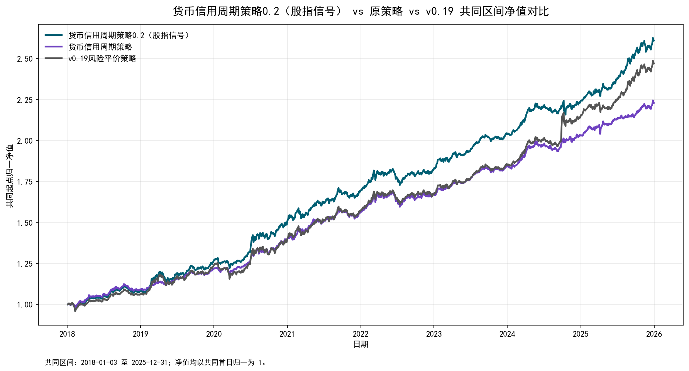

# 货币信用周期策略0.2（股指信号）回测对比说明

## 结论摘要

- 共同回测区间为 `2018-01-03 至 2025-12-31`，共 `1941` 个交易日；三条净值均在共同首日归一为 1。
- 相比原 `货币信用周期策略`，0.2 期末净值 `2.6093` 对 `2.2290`，年化收益高 `2.29%`；年化波动高 `1.29%`，夏普低 `-0.09`，最大回撤基本持平。
- 相比 `v0.19风险平价策略`，0.2 期末净值 `2.6093` 对 `2.4694`，年化收益高 `0.81%`，年化波动低 `0.11%`，夏普高 `0.14`，最大回撤更浅 `2.39%`。
- 年度维度，0.2 相对原策略在 `6/8` 个年份跑赢，相对 v0.19 在 `7/8` 个年份跑赢。

## 对比口径

- 对比对象：`货币信用周期策略0.2（股指信号）`、原 `货币信用周期策略`、`v0.19风险平价策略`。
- 对比区间：取三者净值都有数据的共同区间；0.2 因股指信号首个有效日约束，从 2018 年开始比较更合理。
- 年度收益：首年按共同起点至当年末计算，后续年份按上一年末至当年末计算。
- 策略差异：0.2 使用股指期货信号独立覆盖股指仓位，剩余权重给当前货币信用周期下的非股指资产做风险平价。

## 核心指标

| 策略 | 共同区间 | 交易日数 | 期末净值 | 累计收益 | 年化收益 | 年化波动 | 夏普比率 | 最大回撤 | 最大回撤开始 | 最大回撤结束 | 日胜率 | 月度胜率 | 年度收益均值 |
| --- | --- | --- | --- | --- | --- | --- | --- | --- | --- | --- | --- | --- | --- |
| 货币信用周期策略0.2（股指信号） | 2018-01-03 至 2025-12-31 | 1941 | 2.6093 | 160.93% | 13.26% | 6.38% | 1.98 | -5.39% | 2022-06-09 | 2022-07-15 | 56.47% | 74.74% | 12.81% |
| 货币信用周期策略 | 2018-01-03 至 2025-12-31 | 1941 | 2.2290 | 122.90% | 10.97% | 5.09% | 2.07 | -5.39% | 2022-06-09 | 2022-07-15 | 57.14% | 77.89% | 10.56% |
| v0.19风险平价策略 | 2018-01-03 至 2025-12-31 | 1941 | 2.4694 | 146.94% | 12.45% | 6.49% | 1.84 | -7.79% | 2020-01-20 | 2020-03-19 | 56.21% | 70.53% | 12.03% |

## 年度收益

| 年份 | 货币信用周期策略0.2（股指信号） | 货币信用周期策略 | v0.19风险平价策略 | 相对原策略超额收益 | 相对v0.19超额收益 |
| --- | --- | --- | --- | --- | --- |
| 2018 | 7.94% | 9.02% | 6.12% | -1.08% | 1.81% |
| 2019 | 17.18% | 11.60% | 16.52% | 5.58% | 0.66% |
| 2020 | 19.17% | 14.82% | 13.21% | 4.35% | 5.96% |
| 2021 | 12.45% | 11.98% | 12.40% | 0.47% | 0.05% |
| 2022 | 7.77% | 7.20% | 6.41% | 0.57% | 1.36% |
| 2023 | 11.67% | 9.90% | 10.59% | 1.77% | 1.08% |
| 2024 | 9.71% | 10.20% | 15.97% | -0.50% | -6.27% |
| 2025 | 16.60% | 9.74% | 14.99% | 6.86% | 1.61% |

## 净值图

## 解读

股指信号加入后，0.2 明显补回了原货币信用周期策略在权益趋势阶段的收益弹性。它相对原策略的主要收益改善来自股指仓位的独立覆盖，但代价是波动率抬升，因此夏普没有同步改善。

与 v0.19 相比，0.2 在共同区间实现了更高收益和更浅回撤，同时波动略低，说明“货币信用周期资产池 + 股指信号覆盖”的组合在这段历史样本中比单纯沿用 v0.19 更均衡。后续应重点监控股指信号失效期、信号权重 30% 的敏感性，以及同月象限在实盘中的可获得性。

## 输出文件

- 净值明细：`回测结果_0.2_股指信号\净值\货币信用周期策略0.2（股指信号）净值对比.csv`
- 指标表：`回测结果_0.2_股指信号\指标\货币信用周期策略0.2（股指信号）回测对比指标.csv`
- 年度收益表：`回测结果_0.2_股指信号\指标\货币信用周期策略0.2（股指信号）年度收益对比.csv`
- 图表：`回测结果_0.2_股指信号\图表\货币信用周期策略0.2（股指信号）净值对比.png`
